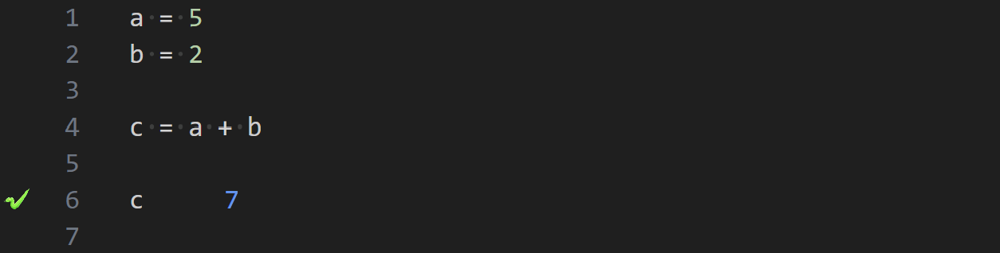
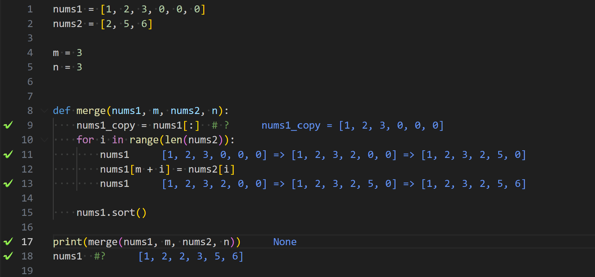
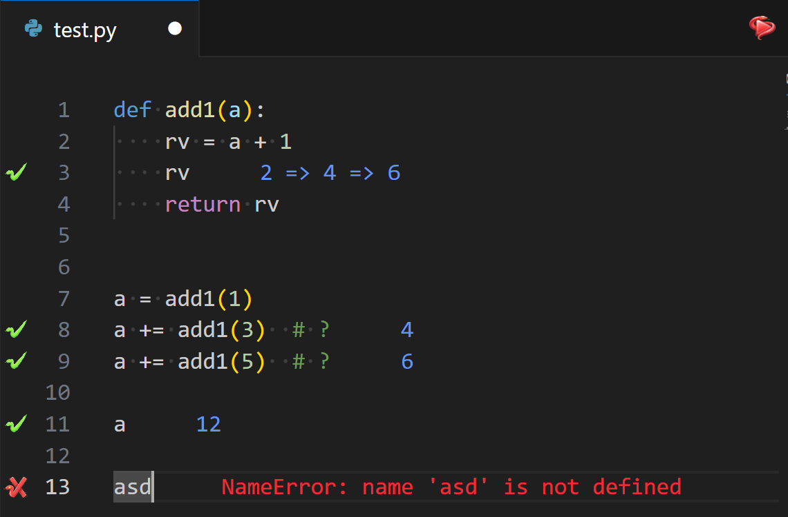

# PyLiveView — Live Python Values in VS Code

PyLiveView brings live, inline Python values and errors directly into your editor as you type. It helps you explore code, teach concepts, and iterate quickly without context switching.

## Overview

PyLiveView executes your active Python file and presents results next to the relevant lines in the editor. It annotates values, highlights errors, and supports common Python patterns including functions, loops, comprehensions, and nested structures.

## Features

- Inline value annotations next to the code you’re editing
- Clear error and exception highlighting with line and message details
- Works across functions, loops, comprehensions, and nested objects
- Honors relative imports and project paths
- Optional decorative gutter icons for quick visual scanning

Illustrative examples:





## Requirements

- Visual Studio Code `^1.51.0`
- Python `3.9+` (tested with 3.10, 3.12)

## Installation

Install from VS Code:

1. Open the Extensions view (`Ctrl+Shift+X`).
2. Search for “PyLiveView”.
3. Install and reload VS Code if prompted.

Alternatively, run from source using the Extension Development Host:

1. Clone or open this repo in VS Code.
2. Press `F5` to launch the Extension Development Host.
3. In the new window, open a Python file and run “PyLiveView: Start PyLiveView on the current file”.

## Development

- Install dependencies: `yarn install`
- Build (development): `yarn webpack`
- Build (watch): `yarn webpack-dev` or use the `typescript: tsc: build - tsconfig.json` task
- Lint: `yarn lint`
- Run tests: `yarn test` (runs webpack, TypeScript compile, and test harness)
- Launch Extension Dev Host: press `F5` in VS Code
- Package VSIX: `yarn ext:package`

## Quick Start

1. Open a Python file in VS Code (e.g., `scripts/test.py`).
2. Run the command: “PyLiveView: Start PyLiveView on the current file” (`pyliveview.runAtCurrentFile`).
3. Open the Output panel (View → Output) and select “PyLiveView” to see interpreter info and logs.
4. Edit your code and watch values appear inline. Use “PyLiveView: Stop all running sessions” (`pyliveview.stopRunning`) to end.

Tips:
- If output looks stale, save the file or restart the session.
- For requests or external APIs, consider caching (e.g., `diskcache`) to avoid unnecessary calls during iterations.

## Commands

- PyLiveView: Start PyLiveView on the current file — `pyliveview.runAtCurrentFile`
- PyLiveView: Stop all running sessions — `pyliveview.stopRunning`

## Settings

- `pyliveview.iconStyleInGutter` (boolean, default: true): Toggle decorative gutter icons.
- `pyliveview.maxLineLength` (number, default: 100): Truncate long inline values.
- `pyliveview.updateFrequency` (number, default: 500): Minimum time between live updates (ms).
- `pyliveview.printLoggingEnabled` (boolean, default: true): Show PyLiveView logs in the Output panel.
- `pyliveview.pythonPath` (string, optional): Path to a Python interpreter (must be 3.9 or greater).

## Troubleshooting

- No annotations appearing:
	- Ensure Python `3.9+` is available and configured (see `pyliveview.pythonPath`).
	- Open the “PyLiveView” Output channel and check for tracer logs or errors.
	- Restart the session: stop then start PyLiveView on the current file.

- Syntax errors:
	- PyLiveView decorates the offending line in red and logs the error message.

- API calls:
	- To avoid unnecessary requests while editing, cache results (e.g., `diskcache`, Redis) or guard calls.

## Acknowledgments
PyLiveView is a modern rebrand and evolution of the original [WOLF](https://github.com/Duroktar/Wolf) extension. This rebranding is intended to honor and preserve that foundation while integrating new features, performance improvements, and UX refinements to extend and enhance the original work. We gratefully acknowledge WOLF’s authors and contributors for pioneering live Python code inspection in VS Code.

## License

PyLiveView is released under the Apache 2.0 License.

## Third-Party Libraries

- [Hunter](https://github.com/ionelmc/python-hunter) — Flexible code tracing toolkit. ([BSD License](https://github.com/ionelmc/python-hunter/blob/master/LICENSE))

## Continuous Publishing (GitHub Actions)

This repository includes a GitHub Actions workflow that will build, run tests, and publish the extension when you push a tag prefixed with `v` (for example `v1.0.0`).

Setup steps:

1. Create a Personal Access Token (PAT) with the `All accessible organizations` and `Marketplace` publishing scope, or follow the `vsce` docs for the exact permissions needed.
2. In your GitHub repo, go to **Settings → Secrets and variables → Actions** and add a secret named `VSCE_PAT` containing the token.
3. Push a git tag to trigger the workflow:

```bash
git tag v1.0.0
git push origin v1.0.0
```

The workflow `.github/workflows/publish.yml` will run and publish the extension automatically.
